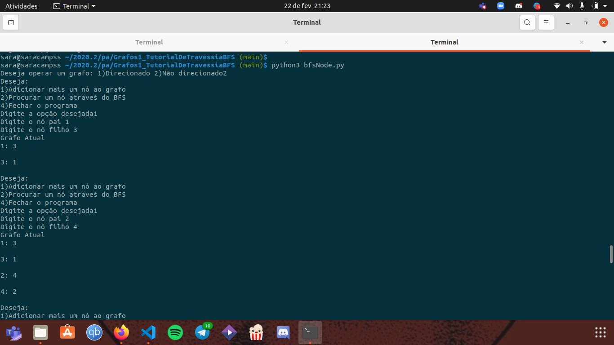
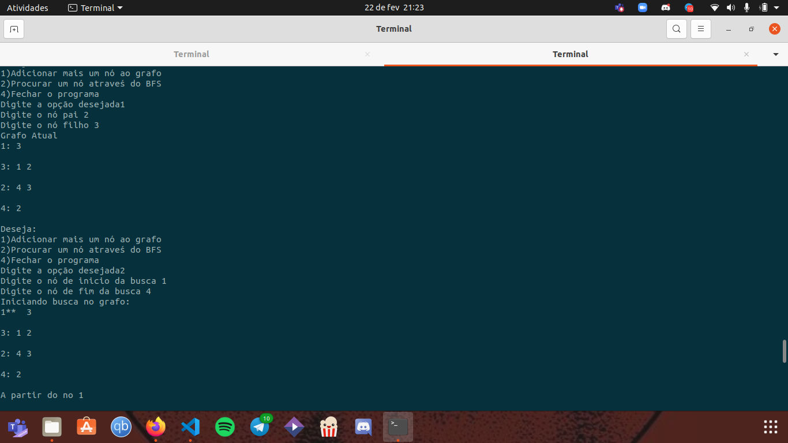
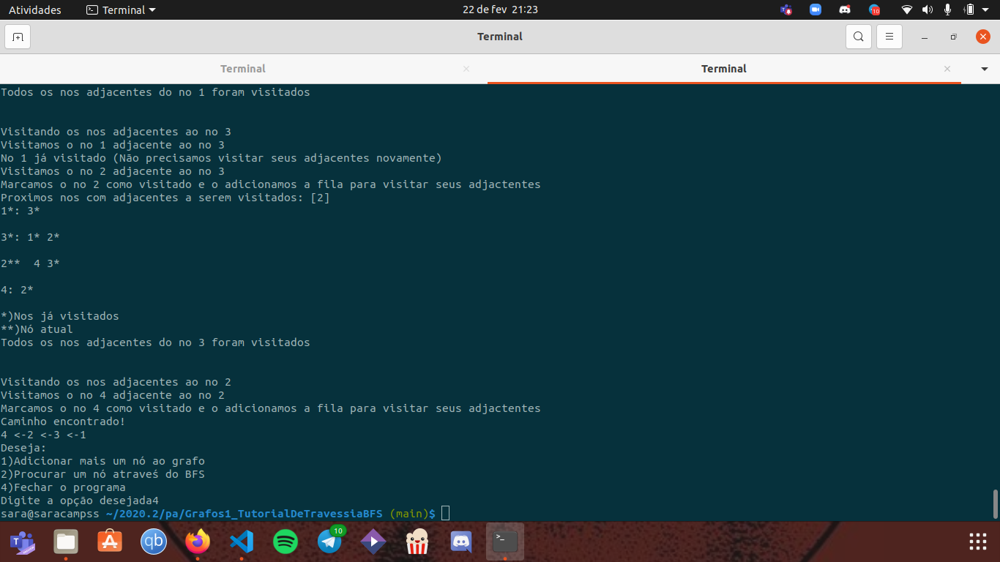

# Grafos1_TutorialDeTravessiaBFS
Programa em python para demonstrar passo a passo o BFS (busca por largura)

**Número da Lista**: 1 
**Conteúdo da Disciplina**: Grafos 1 

## Alunos
|Matrícula | Aluno |
| -- | -- |
| 17/0036634  |  João de Assis |
| 17/0045269  |  Sara Campos |

## Sobre 
O projeto realiza uma travessia por largura no grafo, direcionado ou não, escolhido pelo usuário, explicando cada passo dado no algoritmo.

## Screenshots

## Link para o vídeo no youtube

[Video](https://youtu.be/eDgTeVZqjaw)

## Instalação 
**Linguagem**: Python 
- Instale o Python na sua máquina

        sudo apt-get update
        sudo apt-get install python3.8 python3-pip

- Entre na pasta do repositório
- Rode o projeto com o comando:

        python3 bfsNode.py

## Uso 
O usuário irá se deparar com um menu simples e explicativo onde poderá criar seu grafo para, em seguida, realizar a travessia nele e visualizar os passos dados na BFS. 

